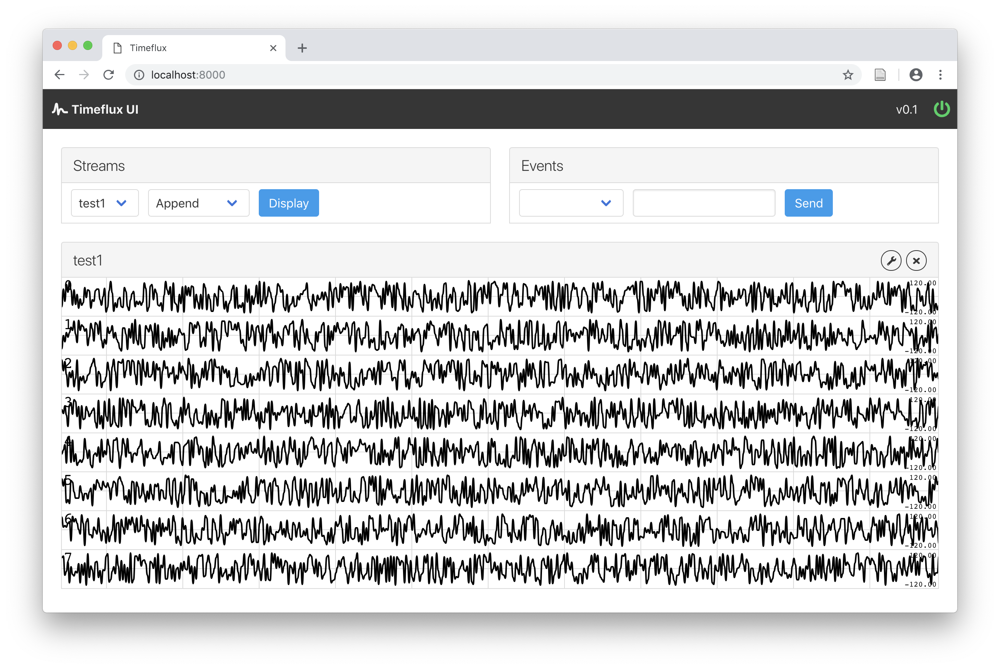

# Timeflux UI

This plugin provides a monitoring web interface for Timeflux. It is not feature-complete yet, but already allows you to visualize your data streams in real-time, in your browser.

## Installation

First, make sure that [Timeflux is installed](https://github.com/timeflux/timeflux).

You can then install this plugin in the ``timeflux`` environment:

```
$ source activate timeflux
$ pip install git+https://github.com/timeflux/timeflux_ui
```

## Screenshot



## Performances

Right now, the time series are displayed in the main thread using the HTML canvas element. On large screens or with high sample rates, performances will degrade significatively. This issue has been adressed with the [SensorChart](https://github.com/mesca/sensorchart) library and WebGL, but this has not been integrated yet. Meanwhile, we advise to downsample your data before sending it to the UI.